# RAG Application - Production-Ready Retrieval-Augmented Generation

[](https://your-app-url.vercel.app)
[](https://github.com/PIYUSH-MISHRA-00/RAG-Application)

A comprehensive, production-ready RAG (Retrieval-Augmented Generation) application that enables users to upload documents, ask questions, and receive AI-powered answers with proper citations. Built with modern technologies and best practices for scalability and reliability.

## 🌟 Features

- **📄 Multi-format Document Support**: Upload `.txt`, `.pdf`, `.docx`, and `.md` files
- **🤖 Advanced RAG Pipeline**: Chunking → Embedding → Vector Search → Reranking → LLM Generation
- **📊 Performance Metrics**: Real-time timing, token usage, and cost estimation
- **🔍 Smart Citations**: Inline citations with source mapping and document references
- **⚡ Multiple Retrieval Strategies**: Standard vector search, MMR for diversity, hybrid search
- **🎯 Production Features**: Error handling, logging, evaluation suite, and monitoring
- **🌐 Modern UI**: Responsive design with dark mode support
- **💰 Cost-Optimized**: Uses Google Gemini embeddings (FREE tier) instead of expensive OpenAI embeddings

## 🏗️ Architecture

```mermaid
graph TB
    A["📱 Frontend (Next.js)"]
    B["🔄 API Routes"]
    C["📝 Text Processor"]
    D["🧠 Embedding Service (Google Gemini)"]
    E["📊 Vector Database (Pinecone)"]
    F["🔍 Retriever (MMR)"]
    G["🎯 Reranker (Cohere)"]
    H["🤖 LLM Service (Groq)"]
    I["📋 Response Formatter"]
    
    A --> B
    B --> C
    C --> D
    D --> E
    B --> F
    F --> E
    F --> G
    G --> H
    H --> I
    I --> A
    
    style A fill:#e1f5fe
    style E fill:#f3e5f5
    style H fill:#e8f5e8
```



### Component Flow

1. **Document Processing**: Files are chunked with overlap and metadata extraction
2. **Embedding Generation**: Google Gemini text-embedding-004 (768 dimensions) - COMPLETELY FREE!
3. **Vector Storage**: Pinecone cloud index with cosine similarity
4. **Query Processing**: MMR for diversity, top-k retrieval
5. **Reranking**: Cohere rerank-english-v3.0 for relevance refinement
6. **Answer Generation**: Groq llama-3.3-70b-versatile with citation integration

## 🚀 Quick Start

### Prerequisites

- Node.js 18+ and npm
- API Keys for:
  - [Google AI Studio](https://makersuite.google.com/app/apikey) (for FREE embeddings)
  - [Groq](https://console.groq.com/) (for LLM)
  - [Pinecone](https://www.pinecone.io/) (for vector database)
  - [Cohere](https://cohere.ai/) (for reranking)

### Installation

1. **Clone the repository**
   ```bash
   git clone https://github.com/PIYUSH-MISHRA-00/RAG-Application.git
   cd RAG-Application
   ```

2. **Install dependencies**
   ```bash
   npm install
   ```

3. **Configure environment variables**
   ```bash
   cp .env.example .env.local
   ```
   
   Fill in your API keys in `.env.local`:
   ```env
   GOOGLE_API_KEY=your_google_api_key_here
   GROQ_API_KEY=your_groq_api_key_here
   PINECONE_API_KEY=your_pinecone_api_key_here
   PINECONE_ENVIRONMENT=your_pinecone_environment_here
   COHERE_API_KEY=your_cohere_api_key_here
   ```

4. **Start the development server**
   ```bash
   npm run dev
   ```

5. **Open your browser**
   Navigate to [http://localhost:3000](http://localhost:3000)

## 📊 Configuration

### Chunking Strategy
- **Chunk Size**: 300 tokens
- **Overlap**: 30 tokens (10%)
- **Separators**: Paragraph → Sentence → Word boundaries

### Vector Database (Pinecone)
- **Index Name**: `rag-documents`
- **Dimensions**: 768 (Google Gemini text-embedding-004)
- **Metric**: Cosine similarity
- **Environment**: Serverless (AWS us-east-1)

### Embeddings (Google Gemini - COMPLETELY FREE!)
- **Model**: `text-embedding-004`
- **Dimensions**: 768
- **Rate Limit**: 15 requests/minute (FREE tier)
- **Daily Limit**: 1,500 requests/day (FREE tier)
- **Cost**: $0.00 - Completely free!

### Retrieval Configuration
- **Initial Retrieval**: Top-3 with MMR (λ=0.7)
- **Reranking**: Top-1 using Cohere rerank-english-v3.0
- **Similarity Threshold**: 0.7

### LLM Configuration
- **Provider**: Groq Cloud
- **Model**: llama-3.3-70b-versatile
- **Max Tokens**: 1024
- **Temperature**: 0.1

## 🎯 Usage

### 1. Upload Documents
- Drag & drop files or click to select
- Supports: .txt, .pdf, .docx, .md (max 10MB each)
- Paste text content directly
- Real-time processing status with detailed terminal information

### 2. Ask Questions
- Type your question in the query interface
- Use advanced options to configure retrieval
- View real-time processing metrics
- Get answers with inline citations

### 3. Review Results
- **Answer**: AI-generated response with citations [1], [2], etc.
- **Citations**: Source text snippets with references
- **Sources**: Document metadata and file information
- **Metrics**: Performance timing and cost breakdown

## 🔧 API Endpoints

### Document Upload
```http
POST /api/upload
Content-Type: multipart/form-data

# Upload files and/or text content
# Detailed progress information available in terminal/console output
```

### Query Processing
```http
POST /api/query
Content-Type: application/json

{
  "query": "Your question here",
  "options": {
    "useMMR": true,
    "useReranking": true,
    "topK": 3,
    "rerankedK": 1
  }
}
```

### System Status
```http
GET /api/status

# Returns system health and configuration
```

### Evaluation
```http
POST /api/evaluate
Content-Type: application/json

{
  "useCustomDocuments": true
}
```

## 📈 Evaluation & Testing

The application includes a comprehensive evaluation suite with 5 Q&A pairs covering:

- **Factual Questions**: Direct information retrieval
- **Analytical Questions**: Complex reasoning and analysis
- **Summary Questions**: Document summarization
- **Specific Questions**: Precise information extraction
- **General Questions**: Broad topic exploration

### Evaluation Metrics
- **Relevance**: Answer relevance to question (0-1)
- **Completeness**: Information completeness (0-1)
- **Accuracy**: Factual accuracy (0-1)
- **Citations**: Citation quality and presence (0-1)
- **Overall**: Weighted average score (0-1)

### Running Evaluation
```bash
# Via API
curl -X POST http://localhost:3000/api/evaluate \
  -H "Content-Type: application/json" \
  -d '{"useCustomDocuments": true}'

# Results include:
# - Success rate and average scores
# - Category-wise breakdown
# - Detailed feedback and recommendations
```

## 📊 Evaluation Results

### Precision and Recall Analysis

**Overall Precision**: 0.82
**Overall Recall**: 0.77
**Success Rate**: 85%

For detailed evaluation results including precision/recall analysis by category, please see [EVALUATION_REPORT.md](EVALUATION_REPORT.md).

## 🚀 Deployment

### Vercel (Recommended)

1. **Connect to Vercel**
   ```bash
   npm i -g vercel
   vercel
   ```

2. **Configure Environment Variables**
   Add all API keys in Vercel dashboard under Project Settings → Environment Variables

3. **Deploy**
   ```bash
   vercel --prod
   ```

### Environment Variables for Production
```env
GOOGLE_API_KEY=your_google_api_key_here
GROQ_API_KEY=your_groq_api_key_here
PINECONE_API_KEY=your_pinecone_api_key_here
PINECONE_ENVIRONMENT=your_pinecone_environment_here
COHERE_API_KEY=your_cohere_api_key_here
PINECONE_INDEX_NAME=rag-documents
NEXT_PUBLIC_APP_URL=https://your-app.vercel.app
```

## 🛠️ Tech Stack

### Frontend
- **Framework**: Next.js 15 with App Router
- **Language**: TypeScript
- **Styling**: Tailwind CSS
- **UI Components**: Custom components with Lucide icons
- **File Upload**: react-dropzone

### Backend & APIs
- **Runtime**: Node.js with Next.js API routes
- **Vector Database**: Pinecone (cloud-hosted)
- **Embeddings**: Google Gemini text-embedding-004
- **LLM**: Groq llama-3.3-70b-versatile
- **Reranking**: Cohere rerank-english-v3.0

### Libraries & Tools
- **Text Processing**: tiktoken for tokenization
- **Document Processing**: pdf-parse, mammoth
- **Utilities**: uuid, langchain integration
- **Development**: ESLint, TypeScript, Tailwind

## 📊 Performance

### Typical Response Times
- **Document Upload**: 2-5s (depending on size)
- **Query Processing**: 3-6s total
  - Embedding: 200-300ms
  - Retrieval: 300-500ms
  - Reranking: 500-800ms
  - LLM Generation: 1-3s

### Cost Estimates (per query)
- **Embeddings**: ~$0.00002
- **LLM**: ~$0.0003-0.0008
- **Reranking**: ~$0.001
- **Total**: ~$0.001-0.002

## 🔒 Security & Privacy

- **API Keys**: Server-side only, never exposed to client
- **Data Storage**: Documents processed in memory, vectors stored in Pinecone
- **Rate Limiting**: Built-in error handling and retry mechanisms
- **Input Validation**: Comprehensive validation for all inputs

## 🐛 Error Handling

Comprehensive error handling includes:
- **Validation Errors**: File size, type, and content validation
- **Service Errors**: API failures with retry logic
- **Rate Limiting**: Graceful handling of quota exceeded
- **Fallback Mechanisms**: Circuit breaker pattern for reliability

## 📝 Logging & Monitoring

- **Error Logging**: Structured error logging with context
- **Performance Metrics**: Response times and cost tracking
- **System Health**: Status endpoint for monitoring
- **Debug Mode**: Development environment debug information

## 🤝 Contributing

1. Fork the repository
2. Create a feature branch (`git checkout -b feature/amazing-feature`)
3. Commit your changes (`git commit -m 'Add amazing feature'`)
4. Push to the branch (`git push origin feature/amazing-feature`)
5. Open a Pull Request

## 🙏 Acknowledgments

- **Google** for powerful embedding models
- **Groq** for fast LLM inference
- **Pinecone** for managed vector database
- **Cohere** for high-quality reranking
- **Vercel** for seamless deployment

## 👨‍💻 Author

**Piyush Mishra**
- Email: [piyushmishra.professional@gmail.com](mailto:piyushmishra.professional@gmail.com)
- GitHub: [PIYUSH-MISHRA-00](https://github.com/PIYUSH-MISHRA-00)
- LinkedIn: [Piyush Mishra](https://linkedin.com/in/piyushmishra)

## 📞 Support

If you have any questions or need help with setup:
1. Check the [Issues](https://github.com/PIYUSH-MISHRA-00/RAG-Application/issues) page
2. Create a new issue with detailed description
3. Contact the author directly

---

## 🎯 Remarks

### Trade-offs and Limitations

1. **Cost Optimization**: Using Google Gemini embeddings provides completely free usage with generous limits, making the system cost-effective for evaluation and small-scale production use.

2. **Chunking Strategy**: Fixed-size chunking with overlap works well for most documents. For complex documents with varying structures, semantic chunking could provide better context preservation.

3. **Reranking**: Limited to top results due to Cohere API constraints. For larger result sets, consider implementing staged reranking or using alternative reranking services.

4. **Document Support**: PDF and DOCX processing relies on text extraction libraries. Complex layouts, images, and tables may not be processed accurately.

5. **Model Selection**: Using Groq's llama-3.3-70b-versatile provides excellent performance with cost efficiency compared to proprietary models while maintaining high quality.

### Future Improvements

- **Semantic Chunking**: Implement content-aware chunking based on document structure and meaning
- **Multi-modal Support**: Add image and table processing capabilities
- **Conversation Memory**: Support for follow-up questions with context retention
- **Advanced Analytics**: Query analytics and usage insights dashboard
- **Custom Models**: Support for fine-tuned or local models for specific domains
- **Collaborative Features**: User accounts and shared document collections
- **Advanced Evaluation**: Automated evaluation with human-in-the-loop feedback

### Provider Limits Encountered

- **Groq**: llama-3.3-70b-versatile offers excellent performance with reasonable rate limits
- **Cohere**: rerank-english-v3.0 provides high-quality reranking with adequate free tier limits
- **Pinecone**: Serverless index on free tier meets requirements for evaluation
- **Google Gemini**: text-embedding-004 offers 1,500 requests/day on free tier (cost-effective for evaluation)

---

**Built with ❤️ for the AI community**